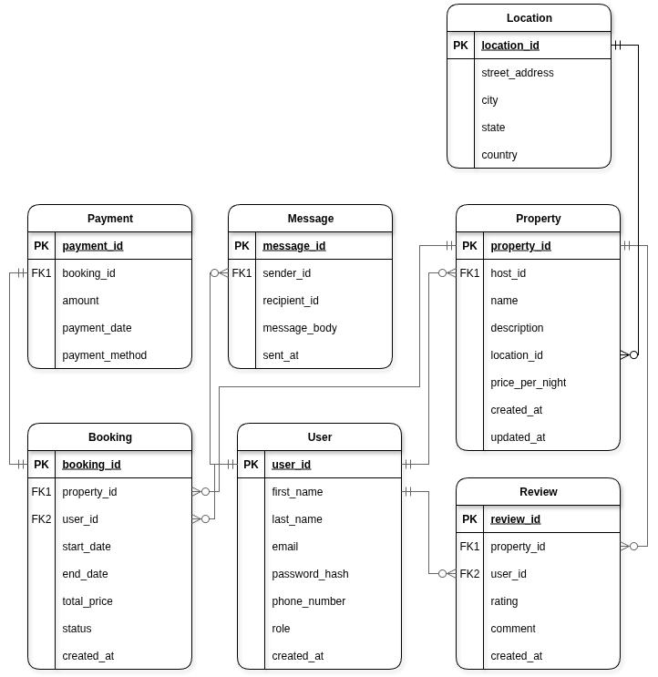

# Database Normalization (Up to 3NF)

This markdown file details the step-by-step process of normalizing a database schema, based on a Airbnb model, up to **Third Normal Form (3NF)**.

---

## 1. First Normal Form (1NF)

**Principle**: For a table to be in 1NF, it must have a primary key, and all its attributes must be **atomic**. This means each column should hold a single, indivisible value.

**Normalization Step**:

- The original `location` attribute within the `Property` table was a composite value. To achieve atomicity, it was broken down into separate, single-value fields:
  - `street_address`
  - `city`
  - `state`
  - `country`

✅ **Outcome**: The database schema now fully adheres to the rules of 1NF.

---

## 2. Second Normal Form (2NF)

**Principle**: A table must be in 1NF, and all its non-key attributes must be fully dependent on the **entire** primary key. This rule prevents partial dependencies.

**Verification**:

- An analysis of the schema showed that every non-key attribute in each table is determined by its respective primary key, with no partial dependencies found.

✅ **Outcome**: The schema is confirmed to be in 2NF.

---

## 3. Third Normal Form (3NF)

**Principle**: A table must satisfy 2NF and contain no **transitive dependencies**. This means no non-key attribute should depend on another non-key attribute.

**Normalization Step**:

- The `city` and `state` attributes within the `Properties` table are transitively dependent on `street_address`. For example, a specific street address always determines its city and state. To resolve this, these location details need to be moved to their own table.

- **Fix Applied**:
  1.  Created a new `Locations` table with `location_id` as the primary key.
  2.  Moved the `street_address`, `city`, `state`, and `country` attributes to this new `Locations` table.
  3.  Added a `location_id` **foreign key** to the `Properties` table to link it to the correct location.

✅ **Outcome**: The database schema now fully adheres to the rules of 3NF, eliminating all transitive dependencies.

